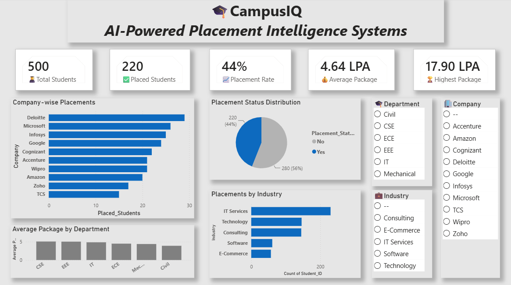

# 🎓 CampusIQ – Student Performance & Campus Analytics Dashboard

## Overview
CampusIQ is an interactive Power BI dashboard developed to analyze student performance, attendance, academic trends, and departmental insights. It helps educational institutions monitor key metrics and make data-driven decisions.

## Features
- Student performance analysis
- Attendance tracking and insights
- Department-wise analytics
- Semester-wise performance trends
- Interactive filters and visualizations
- KPI monitoring dashboard

## Technologies Used
- Power BI
- Microsoft Excel
- Data Visualization

## Skills
- Power BI
- Data Analysis
- Dashboard Design
- Data Visualization
- KPI Reporting
- Microsoft Excel

## Dashboard Preview

## Project File
- CampusIQ.pbix

## Author
Hemshree Bhagavathi S
